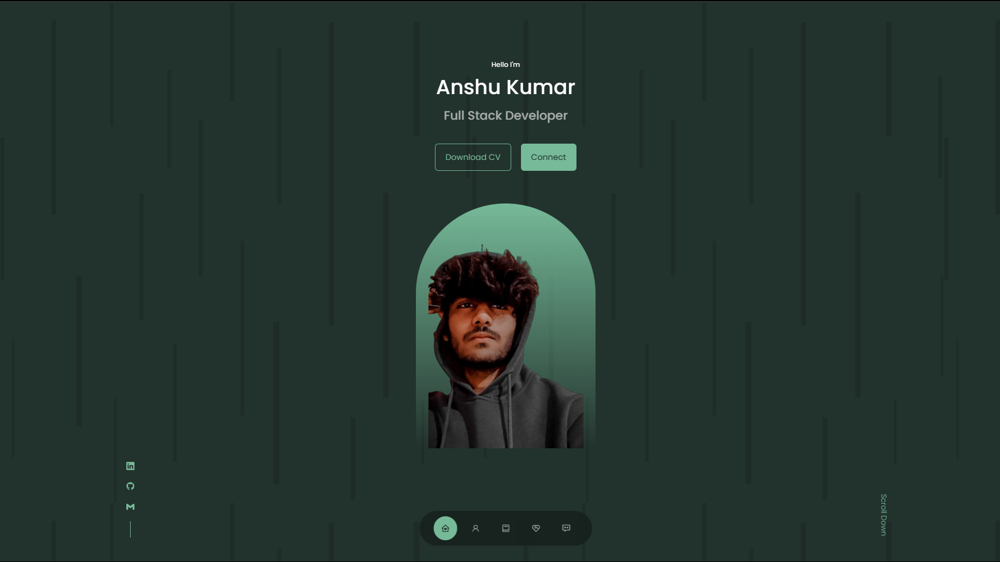

# Portfolio

## Table of Contents
- [Description](#description)
- [Technologies Used](#technologies-used)
- [Features](#features)
- [Installation](#installation)
- [Usage](#usage)

## Description

This is my personal project portfolio, showcasing my web development skills and projects. The portfolio is built using HTML, CSS, JavaScript, and React.js, and it provides a platform to display my work, skills, and contact information.

## Technologies Used

- HTML
- CSS
- JavaScript
- React.js

## Features

- Display information about yourself, including your skills and contact details.
- Showcase your projects with descriptions, images, and links.
- Smooth navigation with a responsive design for various screen sizes.
- Contact form for visitors to get in touch with you.
- Easily customizable to add more sections or update project details.

## Installation

1. Clone this repository:
`git clone https://github.com/ansh2822/Portfolio.git`

2. Navigate to the project directory:
`cd portfolio`

3. Install the required dependencies:
`npm instll`

## Usage

1. Customize the content: Edit the files to add your project details, skills, and contact information.

2. Start the development server:
`npm start`

3. Open your browser and go to `http://localhost:3000` to see your portfolio.

4. Customize the styling in the `src/css` folder to match your branding.

